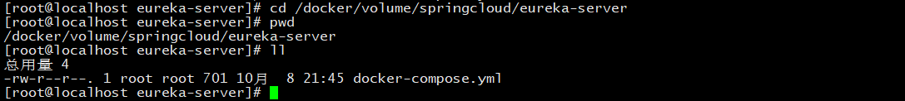

# eureka注册中心搭建
## 一、编写pom文件  
参考[eureka-server.pom](pom.xml)
```xml
<?xml version="1.0" encoding="UTF-8"?>
<project xmlns="http://maven.apache.org/POM/4.0.0"
         xmlns:xsi="http://www.w3.org/2001/XMLSchema-instance"
         xsi:schemaLocation="http://maven.apache.org/POM/4.0.0 http://maven.apache.org/xsd/maven-4.0.0.xsd">
    <parent>
        <artifactId>spring-cloud</artifactId>
        <groupId>com.chennan.cloud</groupId>
        <version>2.0.0</version>
    </parent>
    <modelVersion>4.0.0</modelVersion>

    <artifactId>eureka-server</artifactId>
    <packaging>jar</packaging>
    <description>eureka注册中心</description>

    <properties>
        <java.version>1.8</java.version>
        <maven.compiler.source>1.8</maven.compiler.source>
        <maven.compiler.target>1.8</maven.compiler.target>
        <project.build.sourceEncoding>UTF-8</project.build.sourceEncoding>
    </properties>

    <dependencies>
        <!-- eureka服务端 -->
        <dependency>
            <groupId>org.springframework.cloud</groupId>
            <artifactId>spring-cloud-starter-netflix-eureka-server</artifactId>
            <!-- 排除tomcat -->
            <exclusions>
                <exclusion>
                    <groupId>org.springframework.boot</groupId>
                    <artifactId>spring-boot-starter-tomcat</artifactId>
                </exclusion>
            </exclusions>
        </dependency>
        <!-- 加入jetty依赖 -->
        <dependency>
            <groupId>org.springframework.boot</groupId>
            <artifactId>spring-boot-starter-jetty</artifactId>
        </dependency>
    </dependencies>
</project>
```
## 二、启动类
```java
package com.chennan.cloud;

import org.springframework.boot.SpringApplication;
import org.springframework.boot.autoconfigure.SpringBootApplication;
import org.springframework.cloud.netflix.eureka.server.EnableEurekaServer;

/**
 * spring boot 启动类
 * <br>{@link SpringBootApplication} 微服务启动注解
 * <br>{@link EnableEurekaServer} eureka server启动
 * @author chen.nan 
 */
@SpringBootApplication
@EnableEurekaServer
public class EurekaServer {
    public static void main(String[] args) {
        SpringApplication.run(EurekaServer.class, args);
    }
}

```

## 三、镜像制作上传
```shell script
mvn clean   # 清空编译目录，重新进行编译
mvn install # 重新进行编译，并且把镜像发布到远程docker服务器上
```

## 四、编写docker-compose.yml
```yaml
version: '2'
services:

  eureka1:
    image: eureka-server:2.0.0
    container_name: eureka1
    hostname: eureka1
    networks:
      - eureka-net
    ports:
      - 8761:8761
    environment:
      - spring.profiles.active=eureka1

  eureka2:
    image: eureka-server:2.0.0
    container_name: eureka2
    hostname: eureka2
    networks:
      - eureka-net
    ports:
      - 8762:8762
    environment:
      - spring.profiles.active=eureka2

  eureka3:
    image: eureka-server:2.0.0
    container_name: eureka3
    hostname: eureka3
    networks:
      - eureka-net
    ports:
      - 8763:8763
    environment:
      - spring.profiles.active=eureka3

networks:
  eureka-net:
    driver: bridge

```

## 五.执行并启动eureka集群
```shell script
# 进入到docker-compose.yml文件所在的文件夹位置
cd /docker/volume/springcloud/eureka-server
```
如图:  

```shell script
docker-compose up -d
```
